# HTTP 协议详解 PHP 环境配置

_课程地址：https://www.bilibili.com/video/BV1js411g7Fw?p=4_

**我没有看老师之前关于 php 的教程，所以用的自己熟悉的 XAMPP 来配置环境**

## 下载 XAMPP

根据个人操作系统选择下载文件：[下载连接](https://www.apachefriends.org/index.html)

## 安装 XAMPP

**如果只为这门课程配置环境，可以仅选择 Server->Apache 和 Program Languages->PHP 即可**

如果想学习 PHP，可以全选。

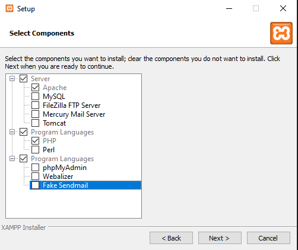

**为了避免某些奇葩的权限问题，建议不要装在系统盘下面。我的系统盘是 C 盘，所以我装在 D 盘下面了**

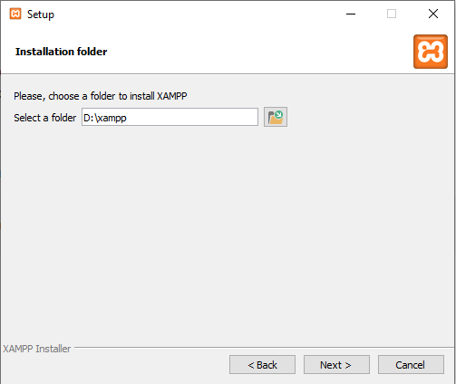

**然后就一直 next 下去，直到安装结束**

## 开启 XAMPP

一般安装完成后会自动打开 XAMPP Control Panel。如果没有的话可以在系统里面搜一下 XAMPP Control Panel

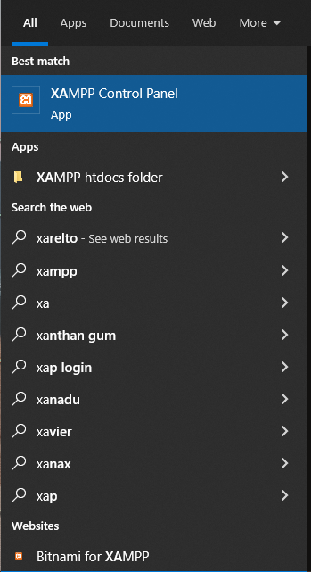

打开后进入如下界面，如果 Apache 左侧出现红叉，点击一下安装 Apache Service 即可。


然后点击 Start 开启 Apache 服务。此时可以看到 Apache 变成绿色，证明 Apache 服务正常运行

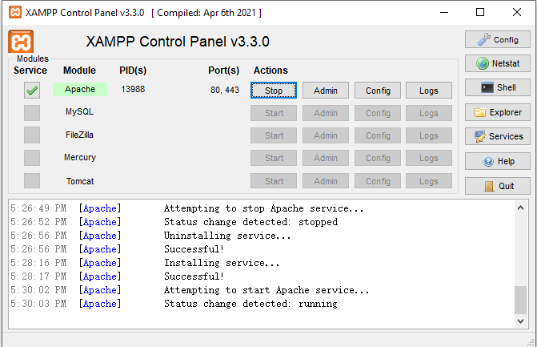

此时，我们可以打开浏览器访问：http://localhost/dashboard/

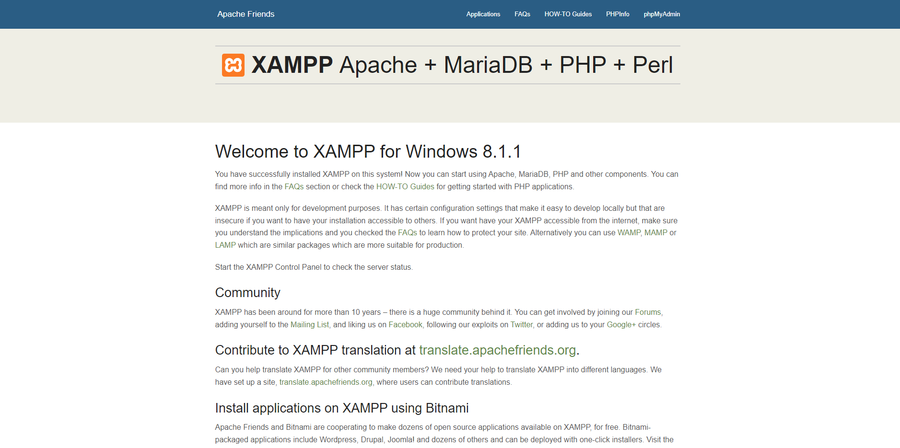

这个页面的文件来源于 D:\xampp\htdocs\dashboard

## 写代码

我们所有的项目文件均在 D:\xampp\htdocs\ 下。

我习惯每个项目新建一个目录，比如说新建一个名为 learn-http 的目录

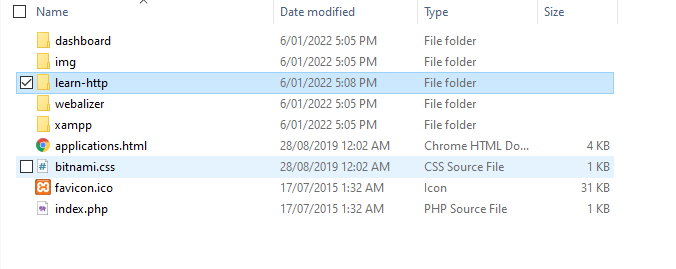

此时可以用我们的 IDE 打开该目录（我用的是 VS Code）

在该目录下创建新目录 lesson1，并在 lesson1 下创建新 php 文件 01.php

**具体目录结构没有特定要求，大家可以根据自己喜好来安排**

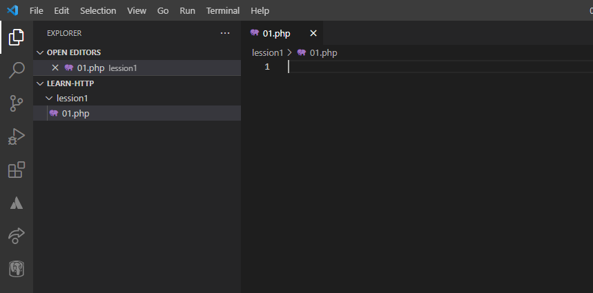

在 01.php 中写入如下代码

```php
<?php
    echo "hello";
?>
```

此时我们在浏览器中访问 http://localhost/learn-http/lesson1/01.php

一般运行哪个文件，就是 http://localhost/ 加上 xampp/htdocs 下的路径

可以看到 echo 的 hello 字符串

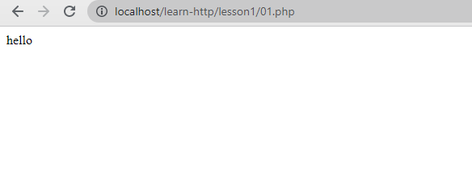

## 关闭服务

学习结束后，返回 XAMPP Control Panel 点击 Stop 停止 Apache 服务


## 添加 PHP 环境变量

**如果在命令行运行 php 文件，我们需要添加 PHP 环境变量**

**这个是针对 Windows 系统的，Mac 的我忘了，大家可以搜一下，不是很难**

打开命令行，输入

```bash
php
```

你会得到如下结果，这个说明系统不识别 php 指令，我们需要将 php 指令添加到系统环境变量中

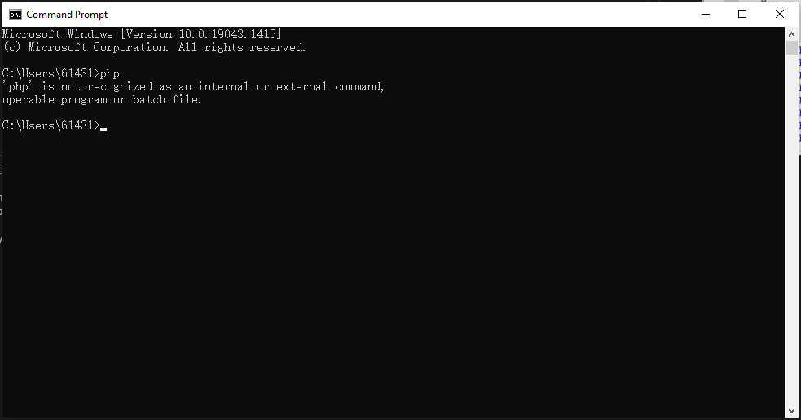

首先在系统中搜索 Environment Variables（中文搜索：环境变量）

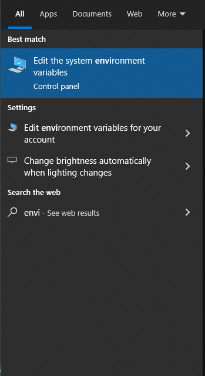

点击 Environment variables...

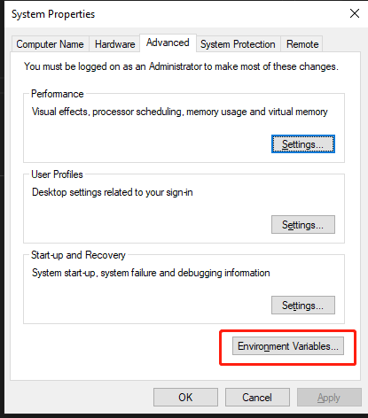

选中 Path 点击 Edit

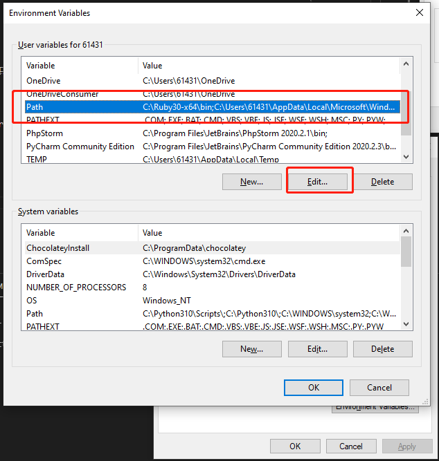

点击 Browse... 选择你安装的 XAMPP 目录下 php 目录

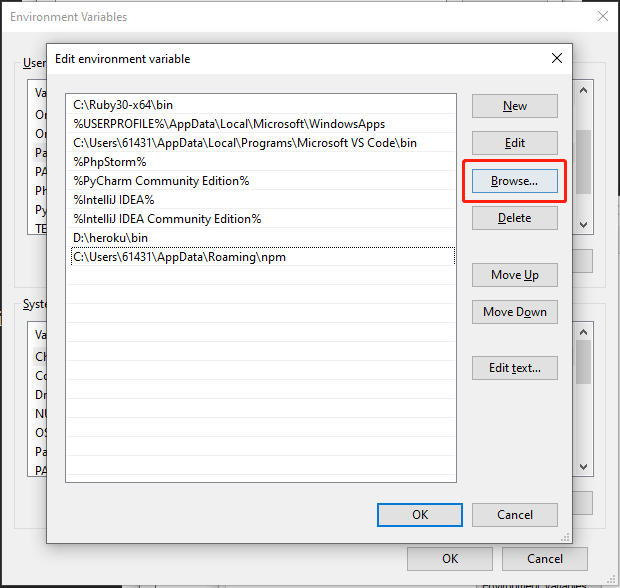

添加完成后你应该有类似如下记录（路径根据你的安装路径会有变化，我是安装在 D 盘）。然后一直点击 OK 关掉所有 Environment variables 相关的小窗口即可

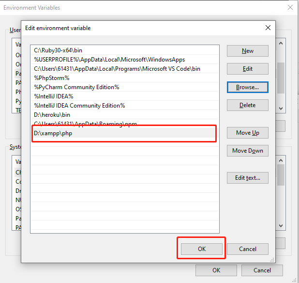

**此时记如果你的 cmd 是开着的，记得关掉打开一个新的**

在命令行输入

```bash
php -v
```

应该可以成功看到 php 版本信息

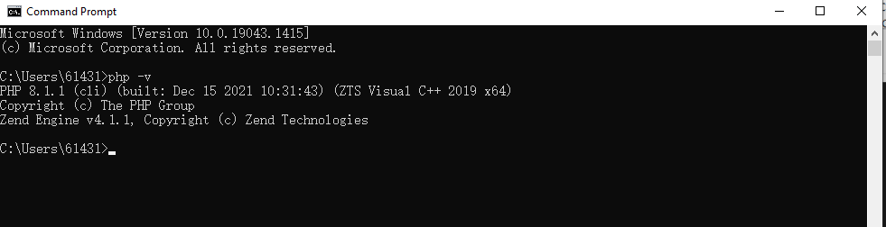

**此时我们可以使用 php + 路径+文件名 来运行 php 文件**

我用的是 VS Code 终端，cmd 所在目录为 D:\xampp\htdocs\learn-http\

所以路径直接写 `lesson1/01.php` 即可

```bash
php lesson1/01.php
```

输出如下

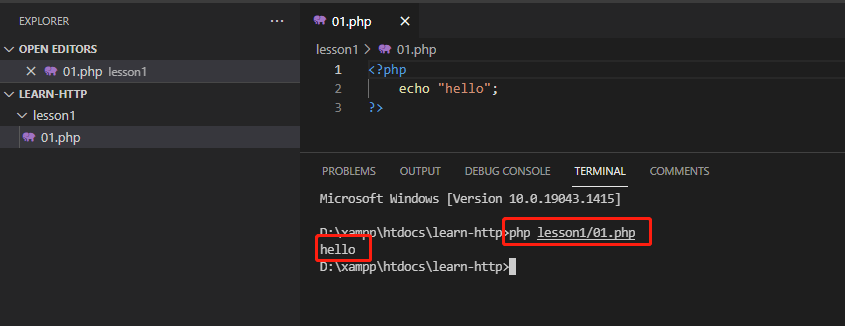

## 关于 Telnet

Win 系统 telnet 有问题的小伙伴可以试一下 Putty [下载链接](https://www.chiark.greenend.org.uk/~sgtatham/putty/latest.html)。

Putty 只有 Win 和 Unix 版本， Mac 我不太了解

安装好后打开 Putty **同时确保你的 XAMPP Apache 服务开启**

-   点击 Session
-   Host Name: localhost
-   Port: 80 (对应 XAMPP Apache 端口，默认都是 80)
-   Connection Type: Other: Raw
-   Close windoes on exit: Never
-   最后点击 Open

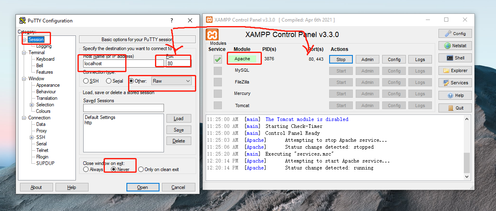

进去后就可以直接输入 `GET / HTTP/1.1` 啥的了

也可以发请求给其他的网站，只需要改下 Host Name，比如说 news.163.com 啥的，web 端口一般都是 80。
