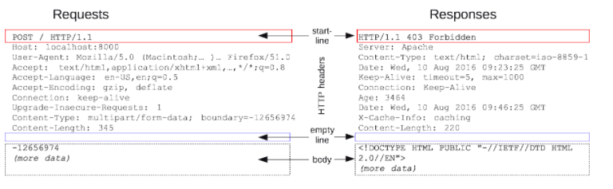
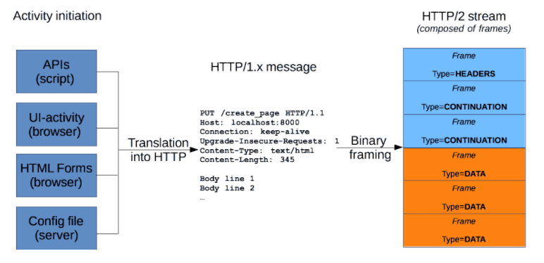
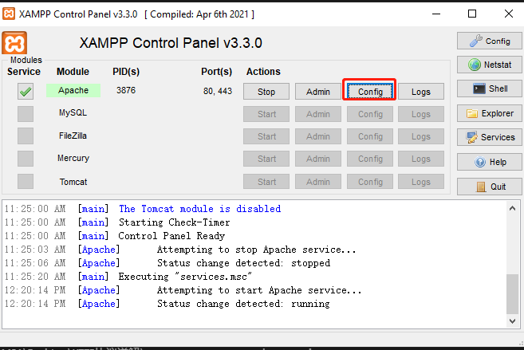

# HTTP 协议详解

_视频地址：https://www.bilibili.com/video/BV1js411g7Fw?p=1_

## P1 HTTP 协议概念及工作流程

### HTTP 信息格式

-   请求/响应 **行** (start-line)
-   请求/响应 **头信息** (HTTP headers)
-   **空行** (Empty line)
-   请求/响应 **主体信息** (body)

_请求和响应的基本格式相同_



#### 补充：



### HTTP 请求格式

-   请求行：`<METHOD> <PATH> <Protocal>/<Version>`
-   请求头：`<key>: <value>`
-   空行
-   请求主体 `<key1>=<value1>&<key2>=<value2>`

举例

1. GET 请求

```bash
    GET /articles/01 HTTP/1.1 #请求行
    Host: mydomain.com        #请求头
    Connection: keep-alive    #请求头
                              #空行
```

2. POST 请求

```bash
    GET /auth/login HTTP/1.1                         #请求行
    Host: mydomain.com                               #请求头
    Content-type: application/x-www-form-urlencoded  #请求头
    Content-length: 28                               #请求头
                                                     #空行
    username=weikun&password=123                     #请求主题

```

## P2 HTTP 协议之方法与状态码

常见方法：GET POST PUT DELETE HEAD OPTIONS TRACE

常见状态码：

-   200：成功
-   301、302：永久、临时重定向
-   304：NOT MODIFIED 未修改（取的缓存，服务器返回 304，浏览器从缓存拿文件）
-   307：重新定向中保存原有请求数据
-   404：不存在

## P6 Referer 头与防盗链

### XAMPP Apache config

XAMPP Apache 的 config 文件在这里：



然后选择第一个 `Apache (httpd.conf)`

改完 `mod_rewrite` 记得重启 Apache 服务
